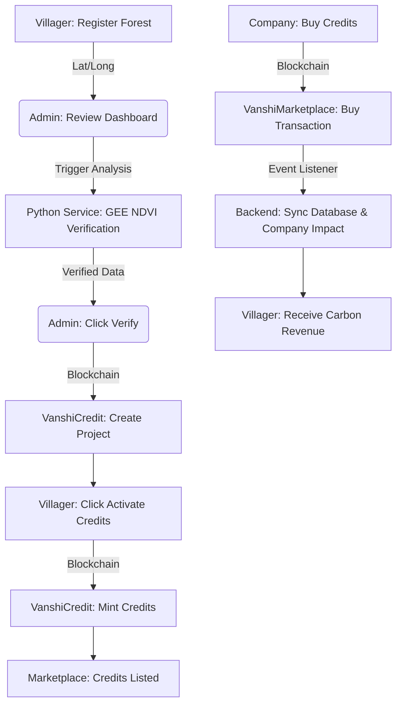

# Vanshi - Forest Carbon Asset Marketplace

Vanshi is a decentralized platform designed to empower community forest owners by digitizing forest carbon sequestration into tradeable carbon credits. It combines **Satellite AI (NDVI Analysis)** for verification, **Blockchain** for immutable credit management, and a **MERN Stack** for a seamless marketplace experience.

---

## 🏗️ Project Architecture

Vanshi operates as a multi-service ecosystem:
- **Frontend**: React-based dashboard for Villagers, Admins, and Corporate Buyers.
- **Backend API**: Node.js/Express orchestrator managing database state and blockchain interactions.
- **Blockchain Core**: Solidity smart contracts (ERC1155) on Ethereum/Hardhat for credit lifecycle and marketplace trades.
- **Satellite Service**: Python/Flask service using Google Earth Engine (GEE) to calculate NDVI (Normalized Difference Vegetation Index) for biomass verification.

---

## 🔄 Project Workflow



### User Roles
1.  **Villager (Community Owner)**: Registers forest land and activates credits upon verification.
2.  **Admin (Verification Body)**: Reviews satellite data, verifies forest health, and initializes on-chain projects.
3.  **Company (The Buyer)**: Purchases verified carbon credits to offset their carbon footprint and tracks ESG impact.

---

## 🛠️ Installation & Setup

### 1. Blockchain Setup (Hardhat)
```bash
cd contracts
npm install
npx hardhat node  # Keep this running in one terminal
npx hardhat run scripts/deploy_vanshi.js --network localhost  # In a second terminal
```
*Note: Copy the contract addresses from the output and paste them into `backend/.env`.*

### 2. Satellite Service (Python)
```bash
cd python-gee-service
pip install -r requirements.txt
python app.py
```

### 3. Backend Setup
```bash
cd backend
npm install
# Create .env with contract addresses, MONGODB_URI, and JWT_SECRET
npm run dev
```

### 4. Frontend Setup
```bash
cd frontend
npm install
npm run dev
```

---

## 📜 Smart Contracts Overview
- **VanshiCredit.sol**: Manages Project Creation and Credit Minting (ERC1155).
- **VanshiMarketplace.sol**: Facilitates atomic swaps between USDC and Carbon Credits.
- **MockUSDC.sol**: Testing token used for marketplace transactions.

---

## 🛠️ Testing the Full Flow
To bypass manual repetitive steps, use the built-in seed script:
```bash
cd backend
node scripts/seed_onchain.js
```
This script automates:
1. Creating a verified forest.
2. Initializing the on-chain project.
3. Funding the project owner for gas.
4. Minting credits to the Marketplace.

---

## 🌟 Vision
Vanshi bridges the gap between grassroots conservation and global carbon markets, ensuring that local communities receive direct financial incentives for preserving Earth's green cover.
